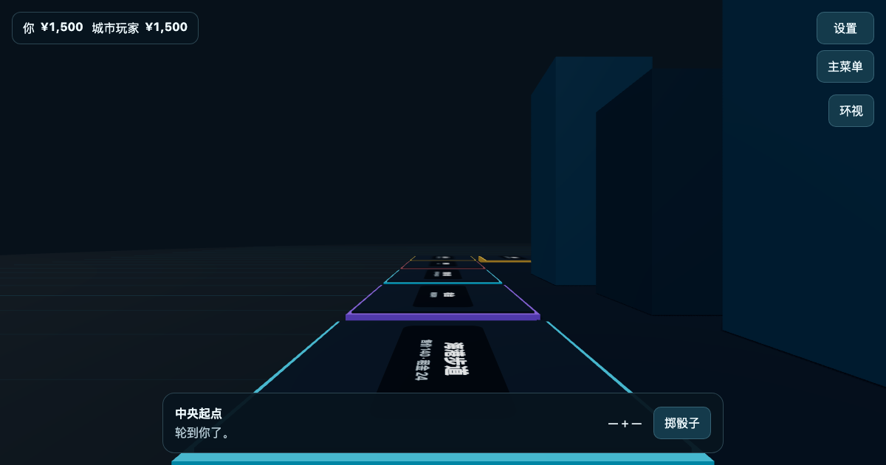

# Richman 3D

**中文** | [English](README.en.md)

支持第一人称与棋盘总览的 3D 大富翁浏览器游戏。使用 **TypeScript + Three.js + WebGL + Vite** 构建，支持2–4席同机真人与电脑对局。视角、声音、语言、鼠标灵敏度、动画速度和第一人称晃动保存在本地偏好中，不写入规则存档。

**在线试玩：https://chiimagnus.github.io/Richman3D/**



## 本地运行

```bash
npm install
npm run dev
```

浏览器打开终端显示的本地地址即可开始游戏。

## 技术栈

- TypeScript
- Three.js / WebGL
- React / React DOM
- Vite
- Vitest

## 开发验证

```bash
npm run typecheck
npm test -- --run
npm run build
```

需要验证实际交互时，使用已安装的 Helium 检查真实游戏页面；不维护浏览器自动化测试。

独立经济模拟（不包含在默认单测中）：

```bash
npm run test:balance -- -t smoke
npm run test:balance
```

完整批次对2/3/4席的快速和标准模式各运行1,000个固定种子，核对资金、牌总量、推进边界和可恢复性；报告在 `test-results/balance/report.json`，不提交。重复相同配置会核对全部非耗时统计。报告只反映电脑策略模拟，不证明真人时长、体验或平衡性；此前不同规则/策略的报告应先保留后移走再生成新基线。
